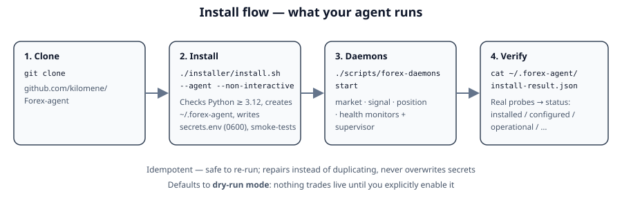
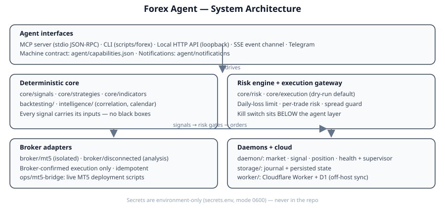
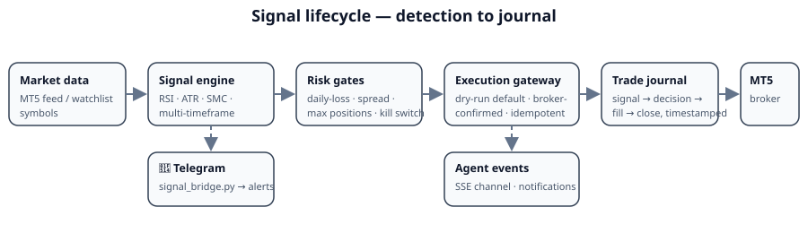

# Forex Agent

[](https://github.com/kilomene/Forex-agent/actions/workflows/build.yml)
[](https://github.com/kilomene/Forex-agent/releases)


An **agent-native forex trading subsystem**: deterministic market analysis, signal detection, and a dry-run-by-default execution gateway that your AI agent can install, operate, and monitor — over MCP, a CLI, a local HTTP API, and Telegram.

> ⚠️ **Demo / research software.** This project trades on demo accounts and is built for research and automation experiments. It is not financial advice. Never point it at real funds unless you fully understand the risk engine and have validated every gate yourself.

---

## 🤖 Install with your AI agent (recommended)

Copy-paste this to your agent:

```
Install the Forex agent from https://github.com/kilomene/Forex-agent:
clone the repo, run the installer non-interactively, verify the
installation, and leave it in dry-run mode. Report the final
install status and broker state.
```

Your agent will:

1. Clone the repository.
2. Run `./installer/install.sh --agent --non-interactive --prefix ~/.forex-agent`
3. Verify Python ≥ 3.12, create the agent home (`~/.forex-agent`), write `secrets.env` (mode `0600`), and smoke-test the manifest, MCP server, and CLI.
4. Start the four background daemons and probe the real broker/config/kill-switch state.
5. Report a machine-readable status (`installed`, `configured`, `operational`, `needs_credentials`, …) from `~/.forex-agent/install-result.json`.

The installer is **idempotent** — safe to re-run any time; it repairs instead of duplicating and never overwrites your secrets file.



---

## What it does

```
Market data → Indicators → Signals → Risk gates → Execution gateway → Broker
                  ↓                                              ↓
            Telegram alerts                                Trade journal
```

- **Signal engine** — deterministic technical analysis (RSI, ATR, SMC concepts, multi-timeframe strategies) across a configurable symbol watchlist. No black boxes: every signal carries its inputs.
- **Risk engine** — equity-based daily-loss limit, per-trade risk %, volume step clamping, max concurrent positions, spread guard, per-symbol and correlation blocking, kill switch. The kill switch sits *below* the agent layer — no prompt can trade through it.
- **Execution gateway** — dry-run by default. Live orders require explicit opt-in, a passing broker probe, and a clear kill switch. Every order is broker-confirmed and idempotent.
- **Agent interfaces** — MCP server (stdio), CLI (`scripts/forex`), loopback-only local HTTP API with an SSE event channel, and an agent notification bridge (Telegram included).
- **Daemons** — market, signal, position, and health monitors with a supervisor and optional systemd units.
- **Cloud layer** (`worker/`) — a Cloudflare Worker (`forex-control-plane`) with D1 storage for syncing state off-host.
- **Live ops bridge** (`ops/mt5-bridge/`) — the battle-tested MT5 deployment scripts: signal bridge to Telegram, trade executor, self-healing MT5/daemon watchdogs, and 15-minute trade-data backups with close reconciliation.



---

## Repository layout

```
.
├── agent/            # Agent interfaces: MCP server, event bus, notifications, tools
├── backtesting/      # Offline strategy backtesting engine
├── broker/           # Broker adapters (MT5 isolated here; disconnected stub for analysis)
├── config/           # Configuration loading + defaults
├── core/             # Signals, strategies, indicators, risk, execution, reconciliation
├── daemon/           # Background monitors + supervisor + systemd units
├── docs/             # Deep-dive docs (architecture, install, security, operations…)
├── installer/        # Idempotent Linux installer
├── intelligence/     # Correlation, economic calendar, experience learning
├── ops/mt5-bridge/   # Live MT5 deployment scripts (signals, executor, watchdogs, backups)
├── scripts/          # CLI (forex), daemon control, local API, manifest generator
├── storage/          # Journal + state persistence
├── tests/            # Full pytest suite
└── worker/           # Cloudflare Worker: API, D1 schema/migrations, contract tests
```

Start with the docs: [ARCHITECTURE](docs/ARCHITECTURE.md) · [INSTALL](docs/INSTALL.md) · [CONFIGURATION](docs/CONFIGURATION.md) · [OPERATIONS](docs/OPERATIONS.md) · [SECURITY](docs/SECURITY.md) · [TELEGRAM_SETUP](docs/TELEGRAM_SETUP.md) · [AGENT_INTEGRATION](docs/AGENT_INTEGRATION.md)

---

## Requirements

- **Linux** (first-class), **Python 3.12+** — stdlib only, no pip dependencies for the core.
- **Node 18+** — only if you want to run the Worker contract tests or deploy the Worker.
- **MT5 terminal** — only for live/demo broker connectivity (see [Live trading](#-live-trading-mt5-bridge)). Analysis mode works with no broker at all.

---

## Manual install

```bash
git clone https://github.com/kilomene/Forex-agent
cd Forex-agent
./installer/install.sh --agent --non-interactive --prefix ~/.forex-agent
cat ~/.forex-agent/install-result.json
```

Then start the daemons:

```bash
./scripts/forex-daemons start
./scripts/forex-daemons status
```

Useful flags: `--skip-daemons` (install only), `--system` (as root: install systemd units + a `forex` user), `--prefix DIR` (custom home). Full reference in [docs/INSTALL.md](docs/INSTALL.md).

### Verify it

```bash
python3 -m pytest tests/ -q            # 395 tests
node --test "worker/tests/*.test.mjs" # 20 contract tests
bash installer/test_idempotent.sh      # 11 installer checks
```

CI runs all of this on every push and pull request.

---

## Configuration

All runtime state lives under `$FOREX_AGENT_HOME` (default `~/.forex-agent`):

| File | Purpose |
|---|---|
| `secrets.env` | Broker/API secrets, mode `0600`, never overwritten |
| `agent.env` | Non-secret defaults (provider, symbols, dry-run) |
| `run/` | Daemon state, cursors, journal |
| `log/` | Daemon logs |
| `install-result.json` | Machine-readable install status |

Secrets (`MT5_LOGIN`, `MT5_PASSWORD`, `MT5_SERVER`, `MT5_GATEWAY_URL`, `MT5_GATEWAY_TOKEN`, `WORKER_API_KEY`) come from the **environment** or an interactive prompt — never from the repo, never printed. See [docs/CONFIGURATION.md](docs/CONFIGURATION.md) and [docs/SECURITY.md](docs/SECURITY.md).

---

## Using it

**CLI:**

```bash
./scripts/forex status
./scripts/forex health
./scripts/forex broker-status
./scripts/forex signals --json
./scripts/forex positions
```

**MCP (for agents):** spawn `python3 -m agent.mcp.server` from the repo root and speak JSON-RPC 2.0 over stdio (`initialize`, `tools/list`, `tools/call`).

**Local API + SSE:** `scripts/local_api.py` serves a loopback-only HTTP API; the SSE channel streams agent events with IDs, severities, and reconnect/resume replay.

**Machine contract:** `agent/capabilities.json` is the machine-readable capability manifest — point your agent at it.

---

## 🔔 Telegram alerts

The signal bridge watches the signal feed and pushes formatted alerts to Telegram in real time:

```
🔔 Signal: GBPUSD M15 BUY @ 1.33643, SL 1.33725, TP 1.33478, RSI 36.1
```

Setup walkthrough: [docs/TELEGRAM_SETUP.md](docs/TELEGRAM_SETUP.md). Trade opens/closes are journaled and can raise their own alerts (`🟢 Opened:` / `🔴 Closed: … P&L`).



---

## 📈 Live trading (MT5 bridge)

`ops/mt5-bridge/` contains the deployment scripts currently running the live demo experiment:

- `signal_generator.py` / `signal_bridge.py` — detect signals, relay to Telegram
- `trade_executor.py` — risk-gated execution with full journaling (`signal.received → trade.decision → command.sent → trade.opened → trade.closed`)
- `watch_mt5.py` — self-healing watchdog: reinstalls Wine and relaunches MT5 after host restarts (~5 min automatic recovery)
- `backup_trading.py` — snapshots all trading state every 15 minutes and reconciles missing close events
- `NovaTrader.mq5` / `NovaSignals.mq5` — the MetaTrader 5 expert advisors

See [ops/mt5-bridge/README.md](ops/mt5-bridge/README.md) and [ops/mt5-bridge/TRADER_README.md](ops/mt5-bridge/TRADER_README.md). Live trading stays **opt-in**: dry-run default, demo-server guard, and the kill switch are all enforced below the agent layer.

---

## ☁️ Worker (cloud sync layer)

The Cloudflare Worker in `worker/` exposes the control-plane API backed by D1. To deploy:

1. Create a D1 database and put its ID in `worker/wrangler.toml` (replacing the placeholder).
2. Add a `CLOUDFLARE_API_TOKEN` secret in the repo's **Settings → Secrets**.
3. Push a change under `worker/**` (or run the workflow manually) — `.github/workflows/deploy-worker.yml` runs the contract tests, then `wrangler deploy`.

Contract: [worker/CONTRACT.md](worker/CONTRACT.md).

---

## Safety model

- **Dry-run default.** Nothing trades live unless you explicitly enable it.
- **Kill switch below the agent.** `run/trading_enabled = "0"` halts execution regardless of what any agent requests.
- **Broker-confirmed execution.** Fills are only recorded when the broker confirms them; reconciliation catches anything else.
- **Secrets are environment-only.** They never enter the repo, logs, or chat.
- **Full journaling.** Every signal, decision, rejection, fill, and close is timestamped and persisted — nothing trades silently.

Read [docs/SECURITY.md](docs/SECURITY.md) and the [2026-09-21 security review](docs/SECURITY_REVIEW_2026-09-21.md) before going further.

---

## Contributing

Issues and pull requests are welcome. CI must stay green: run the test commands above before pushing. Do not commit secrets, tokens, `run/` state, logs, backups, or compiled binaries — see `.gitignore`.

## License

No license file is committed yet — add a `LICENSE` to set the terms (e.g. MIT, Apache-2.0). Demo/research software; not financial advice.
